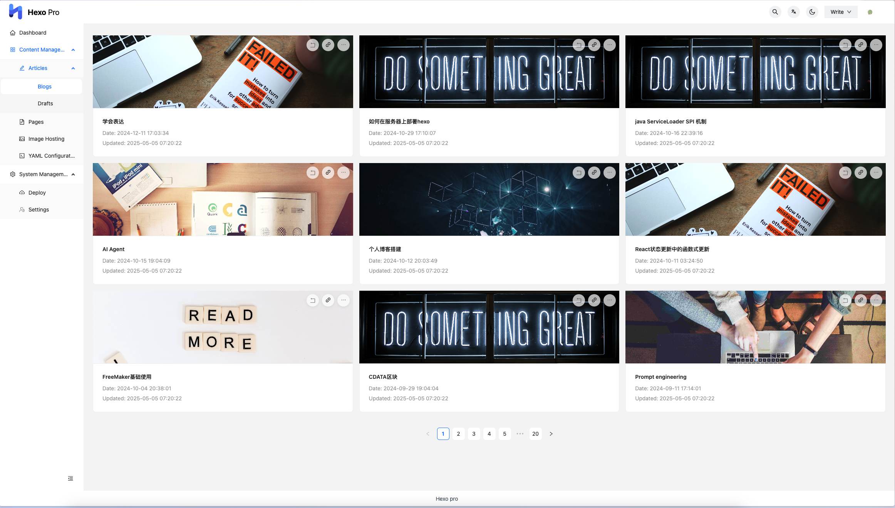
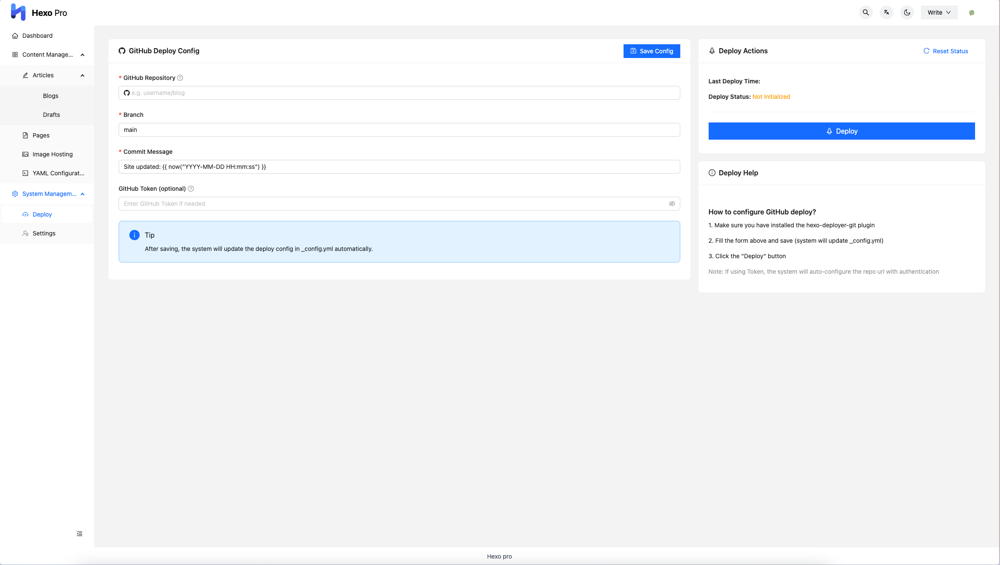

# Hexo Pro

[](https://github.com/wuzheng228/hexo-pro/blob/main/LICENSE)


> 现代化 Hexo 博客后台管理系统，助力高效内容创作与管理

---

## 🏆 项目简介

Hexo Pro 是专为 [Hexo](https://hexo.io/) 静态博客框架打造的后台管理系统插件，旨在为博客作者和开发者提供更强大、更便捷的内容管理体验。

**项目愿景/定位：**  
Hexo Pro为Hexo用户提供专业级内容管理体验，节省您90%的内容维护时间！
如果您觉得这个项目有帮助，请给⭐Star支持开发者！您的支持是我们持续优化的动力！

**相关项目：**
- [Hexo Pro Client](https://github.com/wuzheng228/hexo-pro-client) - Hexo Pro 的前端实现，基于 React 开发的现代化管理界面
---

## ✨ 核心优势

- 🚀 **极致易用**：界面友好，操作直观，零学习成本上手
- 🌗 **多主题支持**：一键切换暗黑/明亮模式，适配不同使用场景
- 📱 **移动端适配**：响应式设计，手机、平板、PC 全面支持
- 🔒 **安全可靠**：支持多用户权限管理，数据安全有保障
- ⚡ **高效集成**：与 Hexo 生态无缝对接，支持主流插件与主题

（可根据实际情况补充更多亮点）

---

## 🎯 功能亮点

- **文章管理**：创建、编辑、删除文章，支持 Front-matter 可视化编辑
- **页面管理**：轻松管理静态页面
- **图床集成**：支持图片粘贴上传与批量管理
- **配置管理**：可视化编辑 Hexo 配置文件
- **全局搜索**：基于 Fuse.js 的极速全文检索
- **一键部署**：多种部署方式，轻松上线
- **国际化支持**：多语言界面，全球用户友好
- **更多功能**：……
---
## 📸 界面预览

| 功能         | 截图 |
|--------------|------|
| 登录页       |  |
| 文章列表     |  |
| 编辑器       |  |
| 主页         |  |
| 图床管理     |  |
| 配置管理     |  |
| 全局搜索     |  |
| 部署         |  |

---

## 🚀 快速开始

### 前置要求

- Node.js 16+
- Hexo 7.x

### 安装步骤

```bash
# 1. 安装 Hexo Pro 插件
npm install --save hexo-pro

# 2. 启动 Hexo 服务器
hexo server -d

# 3. 访问后台管理页面
open http://localhost:4000/pro/
```

首次使用可设置管理员账户或直接跳过进入系统。

## 📦 技术栈
- 后端 ：Node.js + Express
- 数据库 ：NeDB (嵌入式数据库)
- 前端 ：React ( hexo-pro-client )
- 核心依赖 ：Hexo 7.x, Fuse.js, Multer 等
## 📅 更新日志

- **2025-05-10 v1.2.0**
  ✅ 新增图床管理功能
  ✅ 新增yaml配置管理
  ✅ 新增设置和主页功能

- **2024-08-29 v1.1.16**
  🔧 优化编辑器体验
  🌗 改进暗黑模式
  🔍 增强全局搜索功能

## 🤝 参与贡献
欢迎通过以下方式参与项目：

- 提交 Issues 报告问题或建议
- 提交 Pull Request 贡献代码
- 加入 QQ 群交流：1009585669
  
  
## 💬 常见问题（FAQ）

## 📄 许可证
MIT © wuzheng

更多介绍、使用技巧、进阶玩法，欢迎持续关注本项目！

如果本项目对您有帮助，欢迎：
⭐ 给个Star支持
📢 分享给更多Hexo用户
💬 提出宝贵建议

您的支持会让Hexo生态更强大！