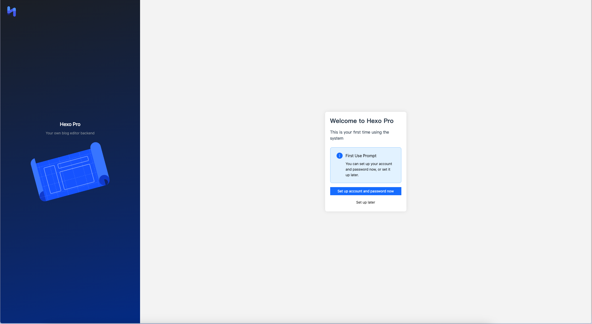
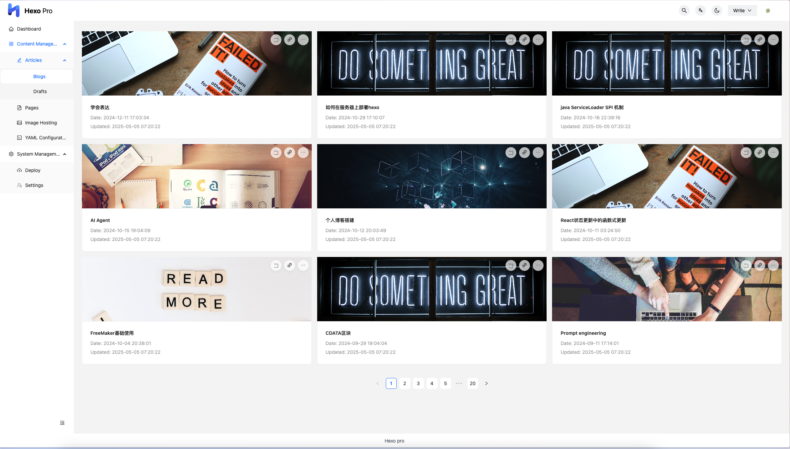
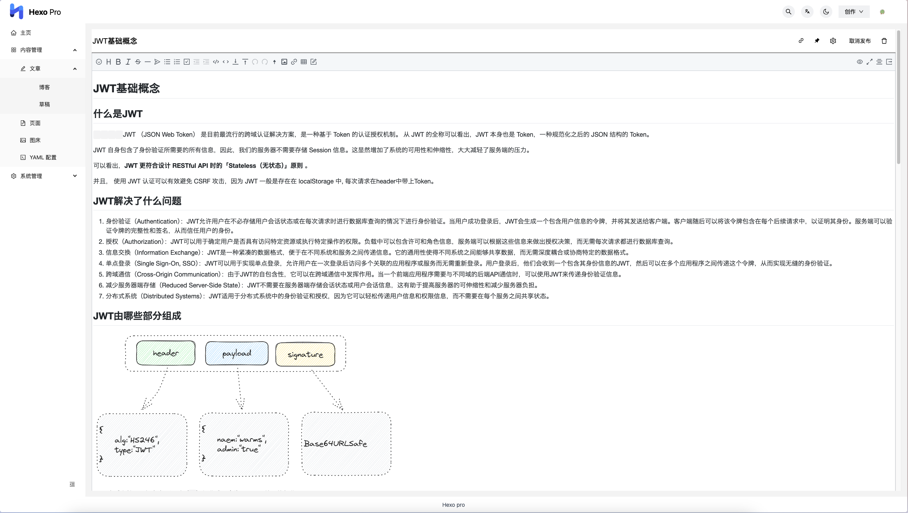
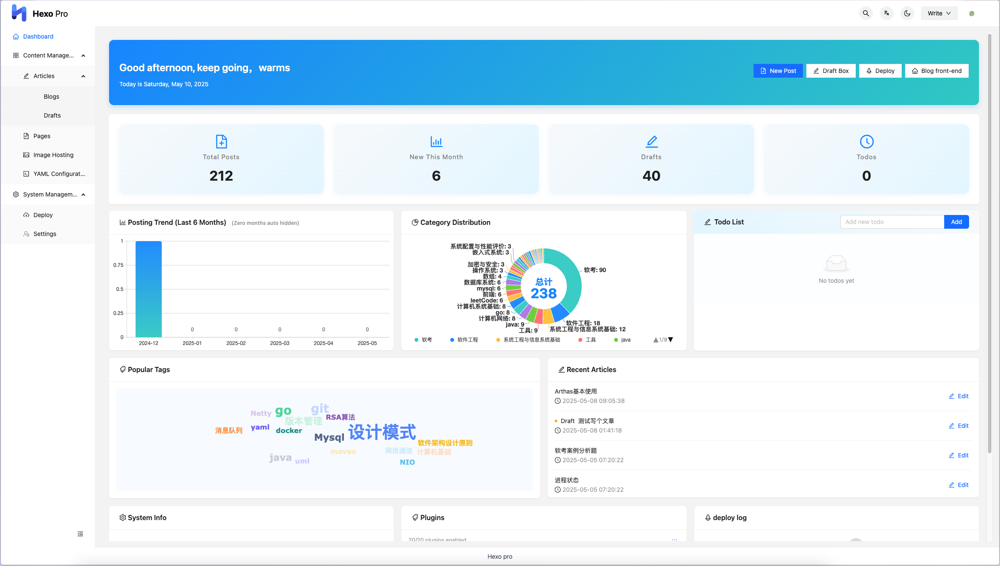
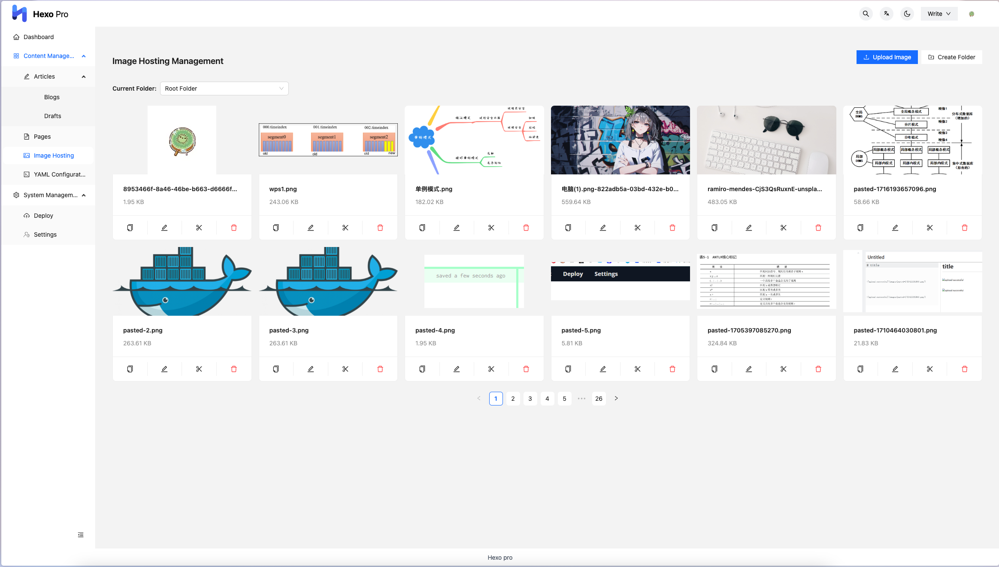
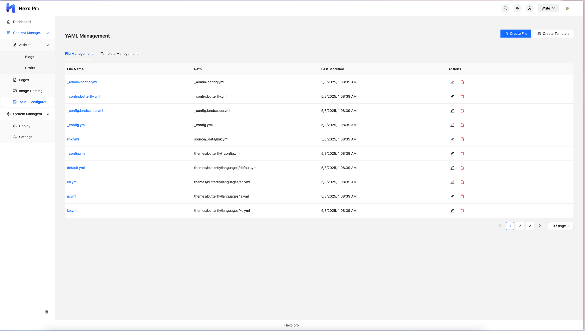
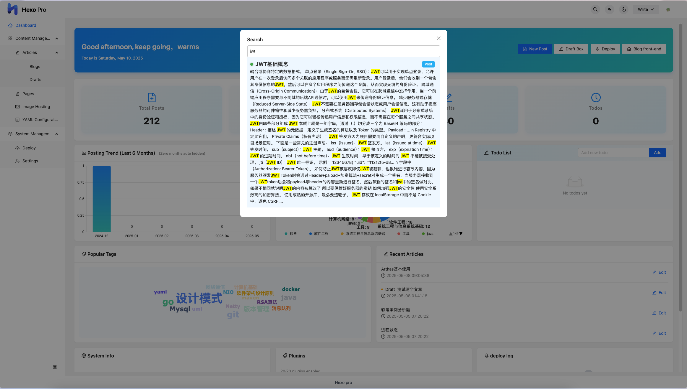
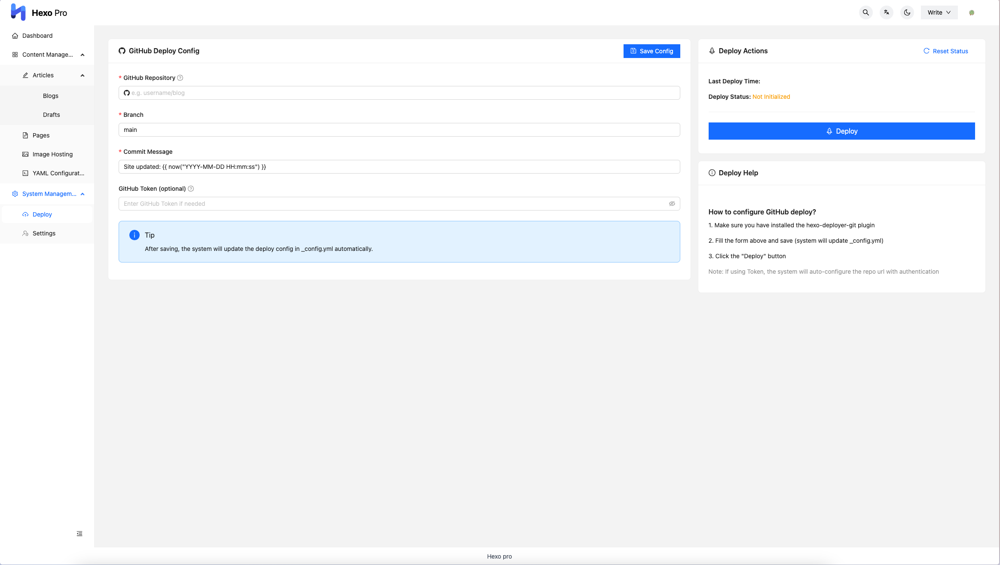

<div align='center'>
    
    <h1>Hexo Pro</h1>
</div>
<div align="center">
  <a href="https://github.com/wuzheng228/hexo-pro/stargazers">
    
  </a>

  <a href="https://github.com/wuzheng228/hexo-pro/blob/main/LICENSE">
    
  </a>

  <a href="https://github.com/wuzheng228/hexo-pro/releases">
    
  </a>
  
  <a href="https://www.npmjs.com/package/hexo-pro">
    
  </a>
</div>

<div align="center">

[中文](./README.md) | [English](./README_en.md)

</div>

<div align="center">
  <h3>🚀 Modern Hexo Blog Management System</h3>
  <p><em>Empowering Efficient Content Creation and Management</em></p>
</div>

---

## 🏆 Introduction

Hexo Pro is a backend management system plug-in designed for the **Hexo** static blog framework, aiming to provide bloggers and developers with a more powerful and convenient content management experience.

Project Vision/Positioning:

Hexo Pro provides Hexo users with a professional-level content management experience, saving you 90% of your content maintenance time!


Related projects:
- [Hexo Pro Client](https://github.com/wuzheng228/hexo-pro-client) - Front-end implementation of Hexo Pro, a modern management interface developed based on React
- [Hexo Pro Desktop](https://github.com/wuzheng228/hexo-pro-desktop) - Desktop client based on Electron, supporting multi-project management and local enhanced experience

---

## ✨ Advantages

* 🚀 Extremely easy to use: user-friendly interface, intuitive operation, zero learning cost
* 🌗 Multiple theme support: one-click switch between dark/light mode, adapted to different usage scenarios
* 📱 Mobile adaptation: responsive design, full support for mobile phones, tablets, and PCs
* 🔒 Safe and reliable: support for multi-user permission management, data security is guaranteed
* ⚡ Efficient integration: seamless integration with the Hexo ecosystem, support for mainstream plug-ins and themes
* 🖥️ Desktop enhancement: support for desktop-exclusive features such as multi-project switching, smart authentication, native menus, and offline management

---

## 🎯 Features

* Article management: create, edit, delete articles, support Front-matter visual editing
* Page management: easily manage static pages
* Image hosting integration: support image pasting, uploading and batch management
* Configuration management: visually edit Hexo configuration files
* Global search: extremely fast full-text search based on Fuse.js
* One-click deployment: multiple deployment methods, easy to go online
* ​​International support: multi-language interface, global user-friendly
* Desktop exclusive: multi-project management, automatic authentication, native menu, offline support, smart port management, etc.
* More features:...

---

## 📦 Structure

This project contains the following submodules:

```
parent-directory/
├── hexo-pro/ # This plugin (backend core)
├── hexo-pro-client/ # Front-end management interface (React)
└── hexo-pro-desktop/ # Desktop client (Electron)
```

* **hexo-pro**: Hexo plugin, providing API and server logic
* **hexo-pro-client**: Modern Web management interface
* **hexo-pro-desktop**: Desktop client, integrated with hexo-pro-core, supports multiple projects and local enhanced experience

---

## 🚀 Quick Start

### 1. Use as a Hexo plugin

#### Prerequisites

* Node.js 16+
* Hexo 7.x

#### Installation steps

```bash
# 1. Install the Hexo Pro plugin
npm install --save hexo-pro

# 2. Start the Hexo server
hexo server

# 3. Access the backend management page
open http://localhost:4000/pro/
```

### 2. Use the desktop client

#### System requirements

* Windows 10+ / macOS 10.14+ / Ubuntu 18.04+
* Node.js 16+

#### Installation and startup

Download **[Releases](https://github.com/wuzheng228/hexo-pro/releases)** pre-built version directly.

#### Instructions

* Select the Hexo blog project directory for the first startup and automatically start the Hexo Pro service
* Supports multi-project switching, automatic authentication, native menus, shortcut keys and other desktop enhancements
* See **Desktop README** for detailed functions
---

## 📸 Previews

<div align="center">

  **Login page** | **Article list** | **Editor**
  :---: | :---: | :---:
   |  | 

  **Home** | **Image Hosting** | **Configuration Management**
  :---: | :---: | :---:
   |  | 

  **Global Search** | **Deploy**
  :---: | :---:
   | 

</div>

---

## 📅 ​​Updates

* 2025-06-15 v1.2.6

✅ **🔧 FrontMatter Boolean fix** - Fixed the display and setting issues of Boolean values ​​in frontMatter to ensure correct handling of true/false values

✅ **🔌 Smart plugin loading** - Optimize plugin loading logic on the desktop, automatically load all available Hexo plugins in node_modules under existing projects

✅ **🌐 Flexible link jump** - The desktop jump link points to localhost:4000 by default, and supports setting custom configuration target addresses

✅ **✏️ Editor default mode** - Added editor default mode configuration, you can set the default working mode of the editor according to your personal preferences

✅ **🖼️ Cover hide control** - Added cover hide setting option, which can hide the article cover image display after turning it on

✅ **⚡ Quick deployment mode** - Added deployment skip static file generation configuration, which can be pushed directly to the warehouse after turning it on to improve deployment efficiency

* 2025-06-07 v1.2.4

✅ Added desktop (hexo-pro-desktop) sub-project to support multi-project management and local enhanced experience

✅ Optimized the core API structure to improve the collaborative experience between desktop and web

* 2025-05-10 v1.2.0

✅ Added image bed management function

✅ Added yaml configuration management

✅ Added settings and homepage functions

* 2024-08-29 v1.1.16

🔧 Optimized editor experience

🌗 Improved dark mode

🔍 Enhanced global search function

---

## 🤝 Contribute

You are welcome to participate in the project in the following ways:

* Submit Issues to report problems or suggestions
* Submit Pull Request to contribute code
* Join QQ group for communication: 1009585669
  
<div align="center">
  
</div>

---

## 📄 License

MIT © wuzheng

---

## ☕️ Donate

Thank you very much for your recognition of this project! If you find it helpful, your support would mean a lot. A small gesture like buying a cup of coffee ☕️ can go a long way in helping us continue to optimize and improve the project.

<div align = "center">
  
  
</div>

---

## 🙏 Thanks

Thanks to the followings for their support of the project, in no particular order. Your donation is the driving force for our continued development!

<div align="center">
  <table>
    <tr>
      <!-- 捐助者 v快 -->
      <td align="center">
        <br>
        <sub><b>v快</b></sub>
      </td>
      <!-- 捐助者 神秘支持者 -->
      <td align="center">
        <br>
        <sub><b>💝 神秘支持者</b></sub>
      </td>
      <!-- 捐助者 Crosery -->
      <td align="center">
        <br>
        <sub><b>Crosery</b></sub>
      </td>
    </tr>
  </table>
</div>


> 💝 ​​Want to be a donor? Scan the QR code above to support the project, and contact us to add your avatar!

---

If you find this project helpful, welcome:

⭐ Give a Star

📢 Share with more Hexo users

💬 Provide valuable suggestions

Your support will make the Hexo ecosystem stronger!

## 📦 Technology stack
- **Backend**: Node.js + Express
- **Database**: NeDB (embedded database)
- **Front-end**: React (hexo-pro-client)
- **Desktop**: Electron (hexo-pro-desktop)
- **Core dependencies**: Hexo 7.x, Fuse.js, Multer, etc.